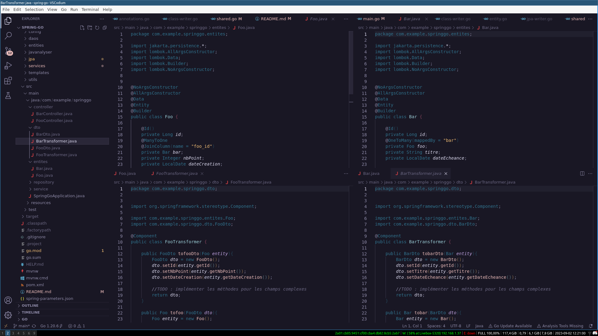

# Spring-go

## Presentation

Spring-go is a command-line application that assists in setting up and managing projects for fullstack Spring-boot / Angular applications based on RESTful APIs. It relies on adhering to the controller - service - jpa repository - mapper - dto design pattern.

The underlying principle is as follows: a backend developer's job is to write business logic, while a frontend developer's role is to create a UI for users to interact with the backend. Any time a backend developer spends writing boilerplate code to enable CRUD operations, and any time a frontend developer spends on backend logic, is time wasted. Spring-Boot / Angular stacks are notorious for this type of code.

The goal of this application is to attempt to address the issues of this technical stack.

## Issues we aim to address
### Verbosity of CRUD operations in Spring Boot

The use of design patterns based on JPA repositories, mappers, and DTOs leads to writing a **large amount of repetitive and hard-to-abstract code without unnecessarily complicating it** (especially with regards to mappers). Some mapping frameworks like Mapstruct attempt to remedy this, but they quickly become complex to use when implementing mapping for complex fields. Our application offers the possibility to **generate boilerplate code (and only boilerplate)**, providing a template for a controller, a service, a repository, a mapper, and a DTO for each entity in a project.

### Verbosity of JPA in entity creation

Initializing a project can sometimes **take a lot of time on Spring**, mainly because we need to write JPA entities. Their configurations are often very verbose. Spring-go offers the ability to do this much faster by typing the name of the entity and its fields in the command line to generate configuration files that can then be used to generate JPA entities, somewhat like a command-line JPA Buddy.

### Inconsistency of design patterns in a large Spring Boot project

It's quite easy for a large project to have multiple people each coming in with their own coding habits. Some will suffix their controllers with "Controller", others with "Ctrl", etc. Some will manually create mappers, others will use mapping frameworks. Some like to have interfaces defining necessary operations for each service, others may forget to implement them. To address this, this program provides **a configuration file and templates to ensure that each element generated by the CLI follows certain design rules regarding class suffixes, implemented interfaces, etc.**

### Lack of Java writing tools for classic text editors
* Not all IDEs necessarily offer a class generation utility, especially text editors enhanced with plugins like VSCode, NeoVim, and Vim. The goal of this project is to provide a program that allows you to **create various types of classes from a command line**. By default, there are templates for classes, interfaces, records, enums, controllers, repositories, services, DTOs, entities, mappers, and exceptions. It is possible to add more by changing a few lines of code, and customize existing ones by simply changing the template content. **Note that this type of template already exists in IntelliJ**.

### Difficulty in maintaining type consistency between backend and frontend

* When using two different languages for the backend and frontend, it can become challenging to ensure type consistency between the two entities, and it is always necessary to generate the same types/structures/classes twice in two different languages. Here, we propose the possibility to **generate TypeScript interfaces from the backend DTOs**.

### Redundancy between backend controllers and frontend HTTP calls

* Once a backend endpoint is defined, in Angular there aren't many ways to make calls to the backend: we create a service using the framework's HttpClient to make the requests. The code structure of this file is entirely dependent on the backend code, which means it can be generated automatically by parsing the Java code of the controllers. This is what this CLI proposes: **automatically generate all HTTP requests to the backend in Angular services**.

### Redundancy in entity change forms:

* Similarly to HTTP calls being entirely dependent on the logic of controllers, forms are also very dependent on the structure of DTOs and their validation logic. While the CLI currently does not yet generate these forms, it should be possible to **create components based on the DTOs and validation annotations present on them**.

### Installation:

For an installation without the intention to modify the source code, it is now possible to grab the release from the GitHub repository and run the installation script following the instructions in the INSTALL file.

The installation works and has been tested in a Linux environment. There is also a functional binary for Windows in another release, but this requires GitBash to be installed and running the script via GitBash.

Alternatively, you can clone the repo, go into the spring-cli folder, and run:

```bash
go install
```
This will create a exectuable in  `~/go/bin/`, assuming `~` is your home folder. 
You need to have go installed for this to work

### Initializing a Project

Assuming you have chosen the alias 'springgo,' run the following command at the root of a Spring Boot project:

This will create a `templates/` folder containing text format templates for each element of a class in a corresponding folder. For example, a Repository will have a `templates/Repository/` folder where you will find a file named `ClassType.txt` containing just the word.
```
interface
```
changing it to
```
class
```
will make it so the repositories are no longer interfaces but classes. More informations in **Personnalisation**

Initializing a project also creates a `jpa/` folder, which will contain all the configuration files generated by the `jpa` command. For more information, refer to the section **Generate CRUD Classes**.

Finally, initializing a project creates a `spring-parameters.json` file. More information can be found in the section:

### Configuration
The default configuration is located in `spring-parameters.json`. It contains the following parameters:

* `base-package`: the base package of the project, which prefixes all others.

* `erase-files`: determines whether, when creating a file with an existing name, it is overwritten or not. **IT IS STRONGLY ADVISED TO KEEP THIS AS FALSE**. The `springgo project` command could potentially reset entire classes if you forget to clean up your JPA folder files when generating new classes (more details on this in the "project generation" section).

* `ts-interface-folder`: folder where TypeScript interfaces will be stored. It is recommended to configure this towards an Angular project (or TypeScript project in general).

* `ts-service-folder`: Same as above, but for HTTP request services.

* `nom-package`: contains options for managing classes of a certain type.

* `package`: sub-package of a class of a certain type.

* `package-policy`: two possible options: `appended`, in which case when specifying an additional package for an entity (for example: "administration.BonDeCommande"), the additional package will be added after the base package. Otherwise, you can choose the "base" option, which allows you to ignore the additional package.

* `suffix`: determines the suffix of classes of a certain type. For example, "Transformer" for mapper-type classes.

### Generating a base java class

```bash
springgo class -c Foo
```

This command allows you to create this simple class:

```java
package com.example.springgo;


public class Foo {

}
```
This class will be placed in the package specified in [spring-parameters.json](spring-parameters.json).

You can also generate a class in this way:

```bash
springgo class -c bar.Foo
```
Thus, the class will be placed in the `bar` package, added to the base package specified in the configuration file.

#### Tip:

It's possible to change the "package" parameter to "default-package" in [spring-parameters.json](spring-parameters.json) to avoid having to specify the package every time you create a class if you're working in the same package all the time.

#### Possible Options:

The `-t` option allows you to specify a particular class type, like this:

Generate a controller:

```bash
springgo class -c Foo -t ctrl
```
```java
package com.example.springgo.controller;

import lombok.RequiredArgsConstructor;
import org.springframework.web.bind.annotation.RequestMapping;
import org.springframework.web.bind.annotation.RestController;    


@RestController
@RequiredArgsConstructor
@RequestMapping("/foo")
public class FooController {

}
```
Generate a service :
```bash
springgo class -c Foo -t srv
```
```java
package com.example.springgo.service;
import lombok.RequiredArgsConstructor;
import org.springframework.stereotype.Service;

@Service
@RequiredArgsConstructor
public class FooService {

}

```
Generate an entity :
```bash
springgo class -c Foo -t ent
```
```java
package com.example.springgo.entites;

import jakarta.persistence.*;
import lombok.AllArgsConstructor;
import lombok.Data;
import lombok.Builder;
import lombok.NoArgsConstructor;    


@NoArgsConstructor
@AllArgsConstructor
@Data
@Entity
@Builder
public class Foo {

}
```
Generate a mapper :
```bash
springgo class -c Foo -t map
```
```java
package com.example.springgo.dto;


import org.springframework.stereotype.Component;


@Component
public class FooTransformer {

}
```
Generate a Dto :
```bash
springgo class -c Foo -t dto
```
```java
package com.example.springgo.dto;

import lombok.AllArgsConstructor;
import lombok.Builder;
import lombok.Data;
import lombok.NoArgsConstructor;


@AllArgsConstructor
@NoArgsConstructor
@Data
@Builder
public class FooDto {

}
```
Generate a Repository :
```bash
springgo class -c Foo -t repo
```
```java
package com.example.springgo.repository;

import org.springframework.data.jpa.repository.JpaRepository;

import java.util.Optional;


public interface FooRepository extends JpaRepository<Foo, Long>  {

}

```
Generate an Exception
```bash
springgo class -c Foo -t ex
```
```java
package com.example.springgo.exception;


public class FooException extends RuntimeException {

}

```
Generate an Enum :
```bash
springgo class -c Foo -t enum
```
```java
package com.example.springgo;


public enum Foo {

}
```
Generate an interface :
```bash
springgo class -c Foo -t int
```
```java
package com.example.springgo;


public interface Foo {

}
```
Generate a record :
```bash
springgo class -c Foo -t rec
```
```java
package com.example.springgo;


public record Foo() {

}

```
Generate an annotation :
```bash
springgo class -c Foo -t ano
```
```java
package com.example.springgo;


public @interface Foo {

}
```

### Generate CRUD classes for new entities:

This is done in two steps.

#### 1. Generate the configuration files for JPA entities
 
```bash
springgo jpa -c Foo -f "bar nbBuzz dateBro"
```
```json
{
    "name": "Foo",
    "package": "com.example.springgo",
    "fields": [
        {
            "name": "bar",
            "type": "String",
            "options": {
                "Annotations": []
            }
        },
        {
            "name": "nbBuzz",
            "type": "Integer",
            "options": {
                "Annotations": []
            }
        },
        {
            "name": "dateBro",
            "type": "LocalDate",
            "options": {
                "Annotations": []
            }
        }
    ]
}
```
The basic usage of this command line option allows you to specify the class name with the `-c` option, and the field names with the `-f` option. By default, the application will try to infer the field type from its name.
You can observe the type inference rules in [this file](./spring-cli/utils/type-inferer.go).

However, if this kind of behavior is not suitable, it is possible to manually type the field using the following syntax:

`<field_name>:<field_type>`

Example:

```
 springgo jpa -c Foo -f "bar nbBuzz:Long dateBro"
```
Here, `nbBuzz` will be of type `Long`.

You can also specify certain annotations using the following syntax:

`<field>@<annotation>`

There are different possible annotations:

`@mtm`: Many to Many

`@mto`: Many to One

`@otm`: One to Many

You can check the logic for creating annotations in [this file](./spring-cli/services/java-classes/shared.go), and you can also add more if you wish.

Finally, the last option is to specify that the field name should take on the type of the field name by capitalizing its first letter. While this may seem very specific, it actually serves to indicate that the field is an entity. For example:

```bash
 springgo jpa -c Foo -f "*bar nbBuzz dateBro "
```
will generate :
```json
{
    "name": "Foo",
    "package": "com.example.springgo",
    "fields": [
        {
            "name": "bar",
            "type": "Bar",
            "options": {
                "Annotations": []
            }
        },
        {
            "name": "nbBuzz",
            "type": "Integer",
            "options": {
                "Annotations": []
            }
        },
        {
            "name": "dateBro",
            "type": "LocalDate",
            "options": {
                "Annotations": []
            }
        }
    ]
}
```

#### 2 Generate a project

```
 springgo project
```

This command will generate the project from the JPA entity configuration files.
For these two commands:

```bash
springgo jpa -c Foo -f "*bar@mto nbPoint dateCreation"
springgo jpa -c Bar -f "*foo@otm titre dateEcheance"
```



### Generate interfaces and services for the Angular HTTP module

The command is extremely simple:

```bash
springgo ng
```
This will generate, in the folder specified in spring-parameters.json, the interfaces and services corresponding to the back-end controllers and DTOs.

For example, for the previously created project, we can get the following results:

Interface for Foo:

```typescript
import { Foo } from './foo'

export interface Bar {
  id: number;
  foo: Foo;
  titre: string;
  dateEcheance: Date;

}
```
interface for Bar :
```typescript
import { Bar } from './bar'

export interface Foo {
  id: number;
  bar: Bar;
  nbPoint: number;
  dateCreation: Date;

}
```
Angular service for Bar :

```typescript
import { Injectable } from '@angular/core';
import { HttpClient, HttpHeaders } from '@angular/common/http';
import { environment } from 'src/environments/environment';
import { Bar } from '../models/bar'


@Injectable({
  providedIn: 'root'
})
export class BarHttpService {

  private URL_ = environment.baseUrl + "/bar";

  constructor(private http:HttpClient) {}


  get(){
    return this.http.get<Bar[]>(this.URL_)
  }


  post(dto : Bar){
    return this.http.post<Bar>(this.URL_, dto)
  }


  put(dto : Bar){
    return this.http.put<Bar>(this.URL_, dto)
  }


  delete(dto : Bar){
    return this.http.delete<Bar>(this.URL_, dto)
  }

}
```
Angular service for Foo :
```typescript
import { Injectable } from '@angular/core';
import { HttpClient, HttpHeaders } from '@angular/common/http';
import { environment } from 'src/environments/environment';
import { Foo } from '../models/foo'


@Injectable({
  providedIn: 'root'
})
export class FooHttpService {

  private URL_ = environment.baseUrl + "/foo";

  constructor(private http:HttpClient) {}


  get(){
    return this.http.get<Foo[]>(this.URL_)
  }


  post(dto : Foo){
    return this.http.post<Foo>(this.URL_, dto)
  }


  put(dto : Foo){
    return this.http.put<Foo>(this.URL_, dto)
  }


  delete(dto : Foo){
    return this.http.delete<Foo>(this.URL_, dto)
  }

}

```

## What This Project Is / Aims to Be

### An API to generate any boilerplate for this stack

* If the templates still require recompiling the project to be changed, the goal of this project is to provide completely customizable templates and configuration files that are not tied to specific libraries.

### A utility providing reusable components to create plugins for text editors

* Currently, viable options for writing Java efficiently are limited to IntelliJ. The LSP provided by Eclipse is clearly not sufficient to allow text editors to make writing a verbose language like Java enjoyable, and this makes any Java developer who has become accustomed to the IntelliJ code analyzer experience completely dependent on JetBrains.

### An exercise

* This project was created more to allow me to improve my skills in learning new languages, creating algorithms, and analyzing code than to be as efficient as possible. There are surely very good utility libraries for string manipulation, templating, or creating files and folders. But due to the educational purpose of the project, I have created a lot of things by hand. In the future, those will probably be replaced by more efficient way of doing things

## What This Project Is Not / Does Not Want to Be

### A better stack

* The goal is not to recreate a stack without the difficulties of Spring Boot / Angular. It is possible that React's Server Components, Next.js, or Go / HTMX may be more suitable technologies for modern web development. However, Spring Boot / Angular exists, has advantages to accompany its difficulties, and it is possible to make the development experience in these conditions more enjoyable.

### Jhipster / Wordpress

* The tool aims to generate customizable boilerplate based on a project's libraries, naming conventions, package organization, etc. (although there is a strong dependency on Lombok). Generally speaking, we do not want to integrate any form of business logic into the classes, and no form of update allowing the automatic creation of security configuration or similar is planned. The goal is to make it a kind of API for generating boilerplate for a Spring Boot / Angular project, not a tool that creates a website filled with uncontrolled code by typing "springgo create facebook" in the terminal.
## Customization

### Customizing Templates
The script is designed to be customizable according to your specific needs for a project. If you use javax instead of jakarta, you will need to customize the generation of Java classes to match your environment. For this, each form of class has a corresponding folder in the `templates/` folder generated by the `init` command.

Here is a summary of the role of each file:

* `Annotations.txt`: Corresponds to the class annotations.
* `Body.txt`: Corresponds to the content of the class, after its declaration.
* `ClassType.txt`: Corresponds to the type of the class: interface, class, record, etc.
* `Extends`: allows you to define a parent class.
* `Implements`: allows you to define implemented interfaces.
* `Imports`: allows you to define the basic imports of the class.

### Customizing Script Logic

The logic for creating classes can be found in `spring-cli/services/class_writer.go`. 
